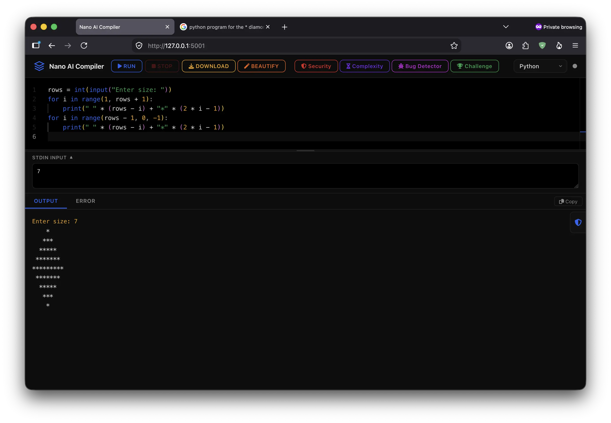
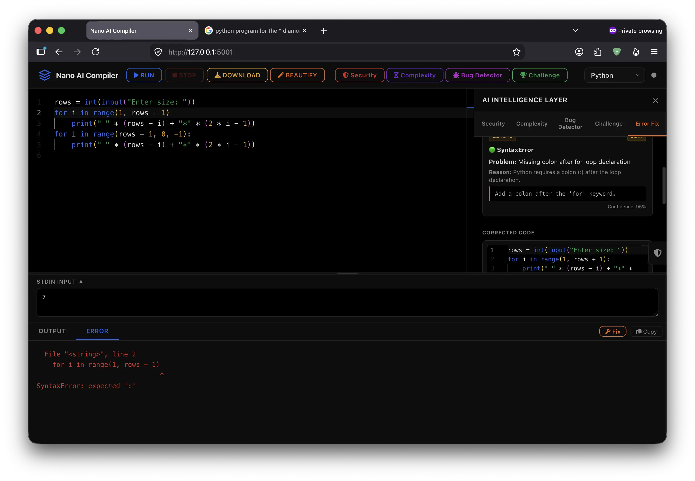

# Nano AI Compiler

Nano AI Compiler is a minimalistic, AI-powered online code compiler that simulates program execution using AI instead of executing user code on real hardware. The project safely predicts program output, compiler errors, runtime errors, and stack traces using an AI model.

The application supports multiple AI providers through separate Git branches, allowing you to choose between local Ollama, Google Gemini, Groq, or NVIDIA AI models. Since each branch contains provider-specific implementation and configuration, select the appropriate branch before installation.

Nano AI Compiler is designed with a zero-execution-risk architecture: user code is never executed using real compilers, interpreters, shells, containers, virtual machines, or operating-system commands. C, C++, Java, C#, Go, Rust, PHP, Ruby, Kotlin, Swift, Bash, SQL, HTML, and CSS.

## Branches and AI Providers

This project contains four branches. Each branch uses a different AI provider and has its own implementation.

| Branch   | AI Provider       | Execution Method |
| -------- | ----------------- | ---------------- |
| `main`   | Ollama            | Local AI model   |
| `gemini` | Google Gemini API | Gemini API       |
| `groq`   | Groq API          | Groq API         |
| `nvidia` | NVIDIA AI API     | NVIDIA API       |

Select the branch corresponding to the AI provider you want to use before following the installation and setup instructions.

## Installation and Setup

### 1. Clone the Repository

```bash
git clone https://github.com/arul637/nano-ai-compiler.git
cd nano-ai-compiler
```

### 2. Select an AI Provider Branch

Choose one of the available branches.

#### Ollama — Local AI

```bash
git checkout main
```

#### Google Gemini

```bash
git checkout gemini
```

#### Groq

```bash
git checkout groq
```

#### NVIDIA AI

```bash
git checkout nvidia
```

Each branch contains its own provider-specific code and configuration.

### 3. Create a Virtual Environment

```bash
python -m venv venv
```

Activate the virtual environment.

#### macOS / Linux

```bash
source venv/bin/activate
```

#### Windows

```bash
venv\Scripts\activate
```

### 4. Install Dependencies

```bash
pip install -r requirements.txt
```

## AI Provider Configuration

### Ollama Branch

The `main` branch uses a locally hosted Ollama model.

Install Ollama:

#### macOS

```bash
brew install ollama
```

#### Linux

```bash
curl -fsSL https://ollama.com/install.sh | sh
```

Pull the required model:

```bash
ollama pull llama3.1:8b
```

Start the Ollama server:

```bash
ollama serve
```

Ollama must be available at:

```text
http://localhost:11434
```

Then start the application:

```bash
python app.py
```

### Gemini, Groq, and NVIDIA Branches

The `gemini`, `groq`, and `nvidia` branches require their respective API keys.

Create a `.env` file in the project root and add the required API key according to the selected branch.

Example:

```env
API_KEY=your_api_key_here
```

Never commit your API key to GitHub.

After configuring the API key, start the application:

```bash
python app.py
```

Open the application in your browser:

```text
http://localhost:5000
```

## Sample Output

### Successful Program Execution

The AI analyzes the submitted source code and simulates the expected program output.



### Compiler or Runtime Error

The AI can also simulate compiler errors, runtime errors, stack traces, and other language-specific error messages.



## Contributing

Contributions, suggestions, and improvements are welcome.

If you discover a bug or have an idea for improving Nano AI Compiler, feel free to open an issue in the repository.

## Contact

If you face any issues, have suggestions, or want to discuss the project, feel free to contact me:

**Email:** [sarulkumaran.21042004@gmail.com](mailto:sarulkumaran.21042004@gmail.com)
**Phone:** 9626192029

You can also raise an issue in the GitHub repository.

---

Made with curiosity, AI, and code.
